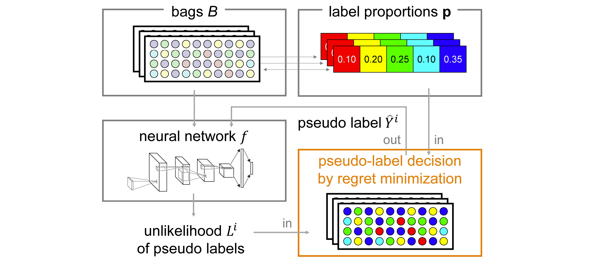

# Learning from Label Proportion with Online Pseudo-Label Decision by Regret Minimization [[S.Matsuo+, ICASSP2023](https://arxiv.org/abs/2302.08947)]
Shinnosuke Matsuo, Ryoma Bise, Seiichi Uchida, Daiki Suehiro



> This paper proposes a novel and efficient method for Learning from Label Proportions (LLP), whose goal is to train a classifier only by using the class label proportions of instance sets, called bags. We propose a novel LLP method based on an online pseudo-labeling method with regret minimization. As opposed to the previous LLP methods, the proposed method effectively works even if the bag sizes are large. We demonstrate the effectiveness of the proposed method using some benchmark datasets.

## Requirements
* python >= 3.9
* cuda && cudnn

We strongly recommend using a virtual environment like Anaconda or Docker. The following is how to build the virtual environment for this code using anaconda.
```
# pytorch install (https://pytorch.org/get-started/locally/)
$ pip3 install torch torchvision torchaudio --index-url https://download.pytorch.org/whl/cu118
$ pip install -r requirements.txt
```

## Dataset
You can create dataset by running following code. Dataset will be saved in `./data` directory.
```
$ python src/make_dataset.py
```

## Training & Test
```
$ python src/main.py
```

## Arguments
You can set up any parameters at `arguments.py`